# Claude Architecture & Agents Assignment

**Course:** AI Systems & Agentic Workflows  
**Student:** Nishant Das   
**Date:** 16 JAN 2026  

## 📋 Assignment Overview
This repository contains all tasks for the "Understanding Claude's Architecture and Agent Creation" assignment.

## ✅ Tasks Completed

| Task | Description | File Link |
|------|-------------|-----------|
| **A** | Architecture Write-up | [Task-A.md](README.md) |
| **B** | .claude.md Configuration | [.claude.md](.claude.md) |
| **C** | 3 Coding Language Skills | [Task-C.md](skills.md) |
| **D** | Engine Workflow Example | [Task-D.md](Task-D-Engine.md) |
| **E** | Agent Concepts | [Task-E.md](Task-E.md) |
| **F** | 2 Agent Designs | [Task-F.md](Task-F-Agents.md) |
| **G** | Multi-Agent System | [Task-G.md](Task-G.md) |


## 📊 Diagrams
- [Architecture Diagram]_(Claude_architecture_stack.drawio.png)
- [Multi-Agent Diagram]_(multi-agent.drawio.png)


## 🏗️ **The 5-Layer Claude Architecture**

## 🏗️ Visual Architecture Overview

```mermaid
graph TD
    subgraph "Claude 5-Layer Architecture"
        A[👤 User Layer<br/>Provides intent & feedback] --> B
        
        subgraph B[📋 Configuration Layer]
            B1[.claude.md<br/>Global Rulebook<br/>• Safety Guidelines<br/>• Tone Rules<br/>• Tool Policies]
        end
        
        B --> C
        
        subgraph C[🧠 Engine Layer<br/>Claude Engine]
            C1[🧩 Task Planner]
            C2[🔀 Skill Router]
            C3[✅ Output Validator]
            C4[💾 State Manager]
            C1 --> C2 --> C3 --> C4
        end
        
        C --> D
        C --> E
        
        subgraph D[🛠️ Skills Layer]
            D1[🐍 Python Analyzer<br/>Code review & security]
            D2[🔧 C Code Auditor<br/>Memory safety & perf]
            D3[☕ Java Reviewer<br/>Architecture & scaling]
        end
        
        subgraph E[🔧 Tools Layer]
            E1[📁 File System]
            E2[💻 Shell/CLI]
            E3[🌐 Web APIs]
            E4[📊 Data Processors]
        end
        
        D --> F[🎯 Output to User]
        E --> F
        
        style A fill:#bbdefb,stroke:#1976d2
        style B fill:#fff9c4,stroke:#f57c00
        style C fill:#c8e6c9,stroke:#388e3c
        style D fill:#ffecb3,stroke:#ffa000
        style E fill:#ffcdd2,stroke:#d32f2f
        style F fill:#e1bee7,stroke:#7b1fa2
    end
```


**Figure 1:** The 5-layer Claude architecture showing data flow and component interactions


Claude-based workflows operate as a layered system where each layer has specific responsibilities. This architecture is reflected in the structure of this repository.

### **1. `.claude.md` - The Global Rulebook**
**Purpose:** Defines boundaries, reasoning habits, and safety guidelines for all Claude interactions.

**In This Repository:**
- **File:** `.claude.md` (root directory)
- **Contents:** Global operating guidelines for SafeTech Corporation
- **Key Rules:** Tone/style guidelines, reasoning constraints, tool usage policies, safety guardrails
- **Example Rule:** "Always verify assumptions before proceeding" or "Never delete files without explicit confirmation"

**Why It Matters:** This file acts as the "constitution" that governs how Claude should think and behave across all tasks, ensuring consistency and safety.

### **2. `skill/` - Specialized Capabilities (Dynamic Resources)**
**Purpose:** Contains reusable "skills" - templates, workflows, or tool wrappers for specific tasks.

**In This Repository:**
- **Implementation:** The `skills.md` file contains three specialized skills:
  1. **`python_analyzer`** - For Python code analysis and security
  2. **`c_code_auditor`** - For C code memory safety and performance
  3. **`java_enterprise_review`** - For Java architecture and scalability
- **Each Skill Includes:** Purpose, inputs, outputs, tools used, algorithms, failure modes, and test cases

**Why It Matters:** Skills make Claude more efficient by providing proven patterns for common tasks, reducing errors and improving consistency.

### **3. Claude Engine - The Orchestrator**
**Purpose:** The core model that interprets intent, decides steps, chooses tools, delegates to sub-agents, and validates outputs.

**In This Repository:**
- **Documentation:** Described in `Task-D-Engine.md`
- **Key Responsibilities:**
  - **Task Planning:** Breaks down complex requests into manageable steps
  - **Skill Selection:** Chooses appropriate skills for each task
  - **Tool Coordination:** Manages calls to external tools
  - **Validation:** Checks outputs for quality and safety
  - **State Management:** Tracks progress through multi-step workflows

**Example Workflow:** See the 10-step execution trace in `Task-D-Engine.md` where the engine coordinates Python, C, and Java analysis in parallel.

**Why It Matters:** The engine transforms user intent into actionable steps, managing complexity and ensuring proper execution.

### **4. Tools - The Execution Layer**
**Purpose:** External capabilities that Claude can use to interact with the environment.

**In This Repository:**
- **Language-Specific Tools:**
  - **Python:** `pylint`, `bandit`, `black`, `ast` module
  - **C:** `clang-tidy`, `cppcheck`, `valgrind`
  - **Java:** `PMD`, `SpotBugs`, `ArchUnit`
- **General Tools:** File system access, web search, code execution

**Tool Usage Policy:** Defined in `.claude.md` with clear allowed/prohibited actions

**Why It Matters:** Tools extend Claude's capabilities beyond text generation, enabling real-world interactions like file operations, code execution, and web searches.

### **5. User - The Director**
**Purpose:** Provides intent, constraints, priorities, and feedback to guide the system.

**In This Repository:**
- **Role:** The ultimate source of goals and validation
- **Interaction Patterns:** Documented in workflow examples throughout tasks
- **Feedback Loop:** Essential for refining agent behavior and improving results

**Why It Matters:** The user ensures the system remains aligned with real-world needs and provides the context necessary for effective problem-solving.

---


```
┌─────────────────────────────────────────────────────────┐
│ GITHUB REPOSITORY │
│ "claude-architecture-agents" │
└───────────────┬──────────────────────────────────────────┘
│
┌──────────┴──────────┐
▼ ▼ ▼
┌─────────────┐ ┌─────────────┐ ┌─────────────────┐
│ ROOT │ 
│ FILES │ │ │ │ │
│ │ │ • arch- │ │ • Task-A.md │
│ • README.md◄┼────┤ diagram │ │ • Task-C.md │
│ • .claude.md│ │ • multi- │ │ • Task-D.md │
│ │ │ agent │ │ • Task-E.md │
└─────────────┘ │ diagram │ │ • Task-F.md │
└─────────────┘ │ • Task-G.md │
└─────────┬───────┘
│
┌─────────────────────────┼─────────────────────────┐
│ │ │
┌─────▼──────┐ ┌────▼──────┐ ┌─────▼─────┐
│ TASK A │ │ TASK C │ │ TASK G │
│ │ │ │ │ │
│ Architecture│ │ 3 Skills │ │Multi-Agent│
│ Flow: │ │ Flow: │ │ Flow: │
│ User → │ │ Python → │ │Coordinator│
│ .claude.md │ │ C → Java │ │ → Agents │
│ → Engine │ │ │ │ → Merge │
│ → Skills │ │ │ │ → Report │
│ → Tools │ │ │ │ │
└─────┬──────┘ └────┬─────┘ └─────┬─────┘
│ │ │
└────────────────────────┼────────────────────────┘
│
┌──────────▼──────────┐
│ TASK D & F FLOW │
│ │
│ Python Skill → │
│ Python Agent │
│ │
│ C Skill → │
│ C Agent │
│ │
│ Java Skill → │
│ Java Agent │
```
└─────────────────────┘

