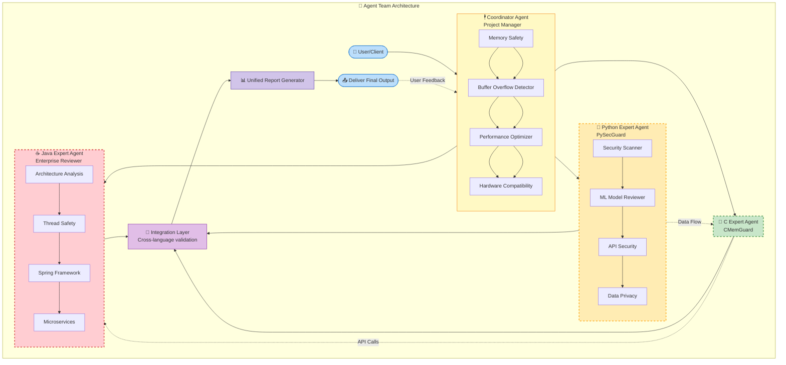

## ✅ **TASK G - MULTI-AGENT ORCHESTRATION**

```
# Task G: Multi-Language Development Team Orchestration

## 🏗️ **System Architecture for Language-Specialized Agents**

### **Complete Agent Team Structure**

                 ┌─────────────────────────────────────┐
                 │          DEVELOPMENT REQUEST        │
                 │  "Build/Review multi-language app"  │
                 └───────────────────┬─────────────────┘
                                     │
                 ┌───────────────────▼─────────────────┐
                 │        PROJECT COORDINATOR          │
                 │              Agent                  │
                 │                                     │
                 │ • Receives project specifications   │
                 │ • Analyzes language composition     │
                 │ • Creates work breakdown structure  │
                 │ • Assigns tasks to language experts │
                 │ • Manages dependencies & timelines  │
                 │ • Merges outputs from all agents    │
                 └───────────────────┬─────────────────┘
                                     │
  ┌──────────────────────────────────┼──────────────────────────────────┐
  │                                  │                                  │
┌─────▼──────────┐ ┌────────▼────────┐ ┌──────────▼─────────┐
│ PYTHON EXPERT │ │ C EXPERT │ │ JAVA EXPERT │
│ Agent │ │ Agent │ │ Agent │
│ │ │ │ │ │
│ • Data Science │ │ • Memory Safety │ │ • Enterprise Apps │
│ • ML Models │ │ • Performance │ │ • Microservices │
│ • Web APIs │ │ • Embedded │ │ • Spring Framework │
│ • Scripting │ │ • Systems │ │ • Android │
└─────┬──────────┘ └────────┬────────┘ └──────────┬─────────┘
│ │ │
└──────────────────────────────────┼──────────────────────────────────┘
│
┌──────────▼──────────┐
│ INTEGRATION & │
│ VALIDATION LAYER │
│ │
│ • Validates APIs │
│ • Checks data flows │
│ • Ensures security │
│ • Tests performance │
└──────────┬──────────┘
│
┌──────────▼──────────┐
│ FINAL DELIVERABLE │
│ │
│ • Unified report │
│ • Integrated code │
│ • Deployment package│
│ • Documentation │
└─────────────────────┘

```


## 🤝 Multi-Agent Coordination System


**Figure 1:** Multi-agent system showing coordinator and specialist agents with integration layer


---

## 🤝 **Agent Roles & Responsibilities**

### **1. Project Coordinator Agent**
**Primary Role:** Team Lead & Orchestrator  
**Communication Protocol:** REST-like API with JSON messages  
**Decision Authority:** High (makes final calls on conflicts)  

**Responsibilities:**
- Parse project requirements and identify language components
- Create task breakdown: Python (40%), C (30%), Java (30%)
- Set quality gates for each language
- Monitor progress and adjust allocations
- Merge results and resolve conflicts
- Generate executive summary reports

**Tools:**
- Project analysis tools (cloc, linguist)
- Dependency mapper
- Progress dashboard
- Report generator

### **2. Python Expert Agent** (PySecGuard from Task F)
**Specialization:** Python Data Science & Security  
**Communication:** Receives Python-specific tasks only  
**Quality Focus:** Security, data privacy, ML model safety  

**Key Metrics:**
- PEP 8 compliance: >95%
- Security vulnerabilities: 0 critical
- Test coverage: >80%
- Performance: Meets SLAs

### **3. C Expert Agent** (CMemGuard from Task F)
**Specialization:** C Memory Safety & Performance  
**Communication:** Receives C-specific tasks only  
**Quality Focus:** Memory safety, performance, hardware compatibility  

**Key Metrics:**
- Memory safety: 100% clean
- Performance: Within 10% of optimal
- Compliance: MISRA C >90%
- Resource usage: Within constraints

### **4. Java Expert Agent** (New - completing the trio)
**Specialization:** Java Enterprise & Microservices  
**Communication:** Receives Java-specific tasks only  
**Quality Focus:** Scalability, maintainability, enterprise patterns  

**Key Metrics:**
- Architecture quality: Layered, testable
- Performance: Response time <100ms
- Security: OWASP Top 10 compliance
- Code quality: SonarQube A rating

---

## 🔄 **Message Flow & Communication Protocol**

### **Protocol Definition:**
```
{
  "message_id": "uuid_v4",
  "timestamp": "ISO_8601",
  "from_agent": "coordinator|python|c|java",
  "to_agent": "coordinator|python|c|java|all",
  "message_type": "task|response|query|alert|complete",
  "priority": "low|medium|high|critical",
  "content": {
    "task": {
      "language": "python|c|java|multi",
      "files": ["list_of_files"],
      "requirements": "specific_requirements",
      "deadline": "timestamp",
      "dependencies": ["other_task_ids"]
    },
    "status": {
      "progress": "0-100",
      "issues": ["list_of_issues"],
      "blockers": ["blocking_items"]
    },
    "result": {
      "findings": ["list_of_findings"],
      "metrics": {"key": "value"},
      "recommendations": ["list"],
      "artifacts": ["generated_files"]
    }
  },
  "requires_response": true|false,
  "response_deadline": "timestamp"
}
```


# Workflow Example: Code Review Request

```
1. User → Coordinator: "Review multi-language PR #123"
   ↓
2. Coordinator analyzes PR:
   • Detects: 3 Python files, 2 C files, 5 Java files
   • Estimates: Python: 15min, C: 25min, Java: 20min
   ↓
3. Coordinator → Python Agent: 
   {
     "task": {
       "language": "python",
       "files": ["api.py", "model.py", "utils.py"],
       "requirements": "security_review",
       "deadline": "+15 minutes"
     }
   }
   ↓
4. Coordinator → C Agent: (similar message for C files)
   ↓
5. Coordinator → Java Agent: (similar message for Java files)
   ↓
6. All agents work in parallel
   ↓
7. Agents → Coordinator: Send results as completed
   ↓
8. Coordinator merges results, resolves conflicts
   ↓
9. Coordinator → User: Unified review report
```

