# Task C: Multi-Language Coding Skills Design

## 🔧 Skills Implementation Architecture

```mermaid
graph LR
    subgraph "🧠 Skill Layer Implementation"
        Input([📥 Input Source<br/>Code/Config/Docs]) --> SkillSelector
        
        subgraph SkillSelector[🔄 Skill Router]
            direction LR
            LangDetect{Language Detector<br/>Python/C/Java}
            LangDetect -->|Python| ToPython[Route to Python Skill]
            LangDetect -->|C| ToC[Route to C Skill]
            LangDetect -->|Java| ToJava[Route to Java Skill]
        end
        
        ToPython --> PythonSkill
        ToC --> CSkill
        ToJava --> JavaSkill
        
        subgraph PythonSkill[🐍 Python Analyzer Skill]
            P1[AST Parser<br/>Syntax tree analysis]
            P2[Security Scanner<br/>Bandit/SAST tools]
            P3[Code Quality<br/>PEP8, pylint, black]
            P4[Performance<br/>Profiling & optimization]
            P1 --> P2 --> P3 --> P4
        end
        
        subgraph CSkill[🔧 C Code Auditor Skill]
            C1[Memory Safety<br/>Valgrind, AddressSanitizer]
            C2[Security Analysis<br/>Buffer overflow detection]
            C3[Performance Audit<br/>Cache efficiency, profiling]
            C4[Hardware Compatibility<br/>Architecture validation]
            C1 --> C2 --> C3 --> C4
        end
        
        subgraph JavaSkill[☕ Java Enterprise Skill]
            J1[Architecture Review<br/>Layered patterns]
            J2[Thread Safety<br/>Concurrency analysis]
            J3[Framework Validation<br/>Spring, Jakarta EE]
            J4[Performance & Scaling<br/>Load testing]
            J1 --> J2 --> J3 --> J4
        end
        
        PythonSkill --> OutputMerger[🧩 Unified Output Formatter]
        CSkill --> OutputMerger
        JavaSkill --> OutputMerger
        
        OutputMerger --> Report[📋 Consolidated Report]
        
        Report --> Deliver([📤 Deliver Analysis])
        
        %% Tool Integration
        PythonSkill -.->|Uses| PTools[🐍 Python Tools<br/>pylint, bandit, black]
        CSkill -.->|Uses| CTools[🔧 C Tools<br/>clang-tidy, cppcheck]
        JavaSkill -.->|Uses| JTools[☕ Java Tools<br/>PMD, SpotBugs, ArchUnit]
    end
    
    %% Styling
    style Input fill:#bbdefb,stroke:#1976d2
    style SkillSelector fill:#fff9c4,stroke:#f57c00
    style PythonSkill fill:#ffecb3,stroke:#ffa000
    style CSkill fill:#c8e6c9,stroke:#388e3c
    style JavaSkill fill:#ffcdd2,stroke:#d32f2f
    style OutputMerger fill:#e1bee7,stroke:#7b1fa2
    style Report fill:#d1c4e9,stroke:#512da8
    style Deliver fill:#bbdefb,stroke:#1976d2
    style PTools fill:#fff3e0,stroke:#e65100
    style CTools fill:#e8f5e8,stroke:#1b5e20
    style JTools fill:#fce4ec,stroke:#880e4f
    
    classDef skillBox fill:#fafafa,stroke:#555,stroke-width:1.5px,border-radius:10px
    class PythonSkill,CSkill,JavaSkill skillBox
```


**Figure 1:** Skill layer implementation showing language-specific analysis pipelines


## Skill 1: `skill/python_analyzer`
### Purpose
Comprehensive analysis, review, and optimization for Python codebases

### Inputs
- Python source files (.py, .pyx)
- requirements.txt or pyproject.toml
- Test files (_test.py, test_.py)
- Project configuration

### Outputs
- PEP 8 compliance report
- Performance metrics
- Security vulnerability list
- Dependency analysis
- Test coverage percentage
- Refactoring suggestions

### Tools Used
- `ast` module (Python's Abstract Syntax Tree)
- `pylint` / `flake8` (code quality)
- `bandit` (security scanning)
- `black` / `isort` (formatting checks)
- `pytest` (test analysis)
- `radon` (complexity metrics)

### Steps / Algorithm
1. **Code Parsing Phase:**
   ```python
   # Example parsing logic
   import ast
   import inspect
   
   def analyze_python_file(filepath):
       with open(filepath, 'r') as f:
           tree = ast.parse(f.read())
       
       # Analyze imports
       imports = [n.name for n in ast.walk(tree) if isinstance(n, ast.Import)]
       
       # Find functions and classes
       functions = [n.name for n in ast.walk(tree) if isinstance(n, ast.FunctionDef)]
       classes = [n.name for n in ast.walk(tree) if isinstance(n, ast.ClassDef)]
       
       return {
           'imports': imports,
           'functions': functions,
           'classes': classes,
           'line_count': len(tree.body)
       }
   ```


# Quality Assessment:

Check PEP 8 compliance (indentation, line length, naming)

Validate docstrings (Google/Numpy style)

Analyze cyclomatic complexity

Check type hint coverage

Security Analysis:

Scan for eval(), exec(), pickle.loads()

Check for hardcoded credentials

Validate input sanitization

Review cryptographic usage

Performance Optimization:

Identify nested loops O(n²)

Check for repeated calculations

Suggest list comprehensions

Recommend caching strategies

Dependency Management:

Analyze import statements

Check for outdated packages

Identify unused imports

Validate virtual environment

# Failure Modes & Mitigations
Syntax Errors: Provide specific line numbers and suggested fixes

Missing Dependencies: Create requirements.txt automatically

Circular Imports: Generate dependency graph, suggest restructuring

Memory Issues: Recommend generators vs lists for large datasets


# Test Cases
# Test 1: Web API with FastAPI

# api.py
```
from fastapi import FastAPI, HTTPException
from pydantic import BaseModel
from typing import Optional
import uvicorn

app = FastAPI()

class Item(BaseModel):
    name: str
    price: float
    is_offer: Optional[bool] = None

@app.get("/")
def read_root():
    return {"Hello": "World"}

@app.post("/items/")
def create_item(item: Item):
    if item.price < 0:
        raise HTTPException(status_code=400, detail="Price cannot be negative")
    return {"item_name": item.name, "price": item.price}
```

# Output

```
Python Analysis Report
=====================
✅ Code Quality: 95/100
✅ PEP 8 Compliance: Perfect
✅ Security: No vulnerabilities detected
✅ Type Hints: 100% coverage
⚠️ Performance: Consider adding response caching
✅ Documentation: Docstrings present
📊 Metrics: 3 functions, 1 class, 20 lines

Recommendations:
1. Add async/await for I/O operations
2. Implement rate limiting
3. Add request validation middleware
```

# Test 2: Data Science Script with Issues

```
# data_analysis.py
import pandas as pd
import numpy as np
import os

def process_data(file_path):
    data = pd.read_csv(file_path)
    
    # Hardcoded credentials - SECURITY ISSUE
    db_password = "mysecret123"
    
    # Inefficient loop - PERFORMANCE ISSUE
    results = []
    for i in range(len(data)):
        results.append(data.iloc[i]['value'] * 2)
    
    # Using eval - SECURITY ISSUE
    user_input = input("Enter calculation: ")
    result = eval(user_input)
    
    return results
```

# Output

```
Python Analysis Report
=====================
⚠️ Code Quality: 65/100
❌ Security Issues: 2 CRITICAL
❌ Performance Issues: 1 MAJOR
✅ PEP 8 Compliance: Basic

CRITICAL ISSUES:
1. Line 9: Hardcoded password found
   Fix: Use environment variables or secret management
   
2. Line 16: eval() with user input
   Fix: Use ast.literal_eval() or safe parser

MAJOR ISSUES:
1. Line 11-13: Inefficient pandas iteration
   Fix: Use vectorized operations: data['value'] * 2

RECOMMENDATIONS:
1. Remove hardcoded credentials immediately
2. Replace eval() with safer alternative
3. Use pandas vectorization
4. Add type hints and docstrings
```


# Skill 2: skill/c_code_auditor
# Purpose
Static analysis, memory safety, and performance auditing for C code

# Inputs
C source files (.c, .h)

Makefile or build configuration

Compiler flags used

Platform constraints (embedded/desktop)

# Outputs
Memory safety report

Buffer overflow detection

Performance bottlenecks

Portability issues

MISRA C compliance (if applicable)

Security vulnerabilities

# Tools Used
clang-tidy (static analysis)

cppcheck (C/C++ analysis)

valgrind (memory analysis - if executable)

splint (security-focused analysis)

gcc with sanitizers (address/undefined behavior)

Custom pattern matchers for C-specific issues


# Steps / Algorithm
# Preprocessing Analysis:

Check macro definitions

Analyze header file inclusions

Validate conditional compilation

Check for circular dependencies

# Memory Safety Audit:

Detect buffer overflows

Check pointer arithmetic

Validate malloc/free pairs

Identify memory leaks

Check for uninitialized variables

# Security Analysis:

Scan for strcpy() vs strncpy()

Check integer overflows

Validate format strings

Detect TOCTOU vulnerabilities

Check privilege escalation risks

# Performance Analysis:

Identify expensive system calls

Check loop optimizations

Analyze cache efficiency

Review algorithm complexity

Suggest inline assembly optimizations

# Portability Check:

Platform-specific code detection

Endianness issues

Data type size assumptions

Compiler-specific extensions

# Special C-Focused Checks:

```
// Common patterns to detect:

// 1. Buffer overflow risks
char buffer[10];
strcpy(buffer, input);  // DANGER

// 2. Memory leak patterns
void leaky_function() {
    char *ptr = malloc(100);
    // No free() - LEAK
}

// 3. Signed/unsigned mismatches
int i = -1;
unsigned int j = 100;
if (i < j) { /* Unexpected behavior */ }

// 4. Pointer arithmetic risks
int array[10];
int *ptr = array + 20;  // OUT OF BOUNDS
```

Failure Modes & Mitigations
Undefined Behavior: Use clang undefined behavior sanitizer

Platform Dependencies: Run analysis for multiple architectures

Complex Macros: Expand macros before analysis

Assembly Inline: Flag for manual review

# Test Cases
# Test 1: Embedded Systems C Code

```
// sensor_reader.c
#include <stdio.h>
#include <stdlib.h>
#include <string.h>

#define MAX_SENSORS 10
#define BUFFER_SIZE 256

typedef struct {
    int id;
    float value;
    char unit[10];
} SensorData;

void read_sensor_data(SensorData *data, int count) {
    if (count > MAX_SENSORS) {
        printf("Error: Too many sensors\n");
        return;
    }
    
    for (int i = 0; i < count; i++) {
        // Simulate sensor reading
        data[i].id = i;
        data[i].value = (float)(rand() % 100);
        strcpy(data[i].unit, "Celsius");  // POTENTIAL BUFFER ISSUE
    }
}

int process_data(const char *input, char *output) {
    char buffer[BUFFER_SIZE];
    
    // UNSAFE: No bounds checking
    sprintf(buffer, "Data: %s", input);
    
    // Copy to output - RISK OF OVERFLOW
    strcpy(output, buffer);
    
    return strlen(output);
}
```

# Output

```
C Code Audit Report
===================
🔴 Memory Safety: 3 CRITICAL ISSUES
⚠️ Security: 2 MAJOR ISSUES
✅ Performance: Good
🔵 Portability: Platform independent

CRITICAL MEMORY ISSUES:
1. Line 23: strcpy() without bounds checking
   Risk: Buffer overflow in SensorData.unit
   Fix: Use strncpy(data[i].unit, "Celsius", sizeof(data[i].unit)-1)

2. Line 31: sprintf() with unbounded input
   Risk: Format string vulnerability
   Fix: Use snprintf(buffer, sizeof(buffer), "Data: %s", input)

3. Line 34: strcpy() without length validation
   Risk: Output buffer overflow
   Fix: Use strncpy(output, buffer, output_size-1)

MAJOR SECURITY ISSUES:
1. Line 8: Fixed array size without validation
   Suggestion: Add runtime bounds checking

2. Line 19: rand() for sensor data
   Suggestion: Use cryptographically secure random for security apps

RECOMMENDATIONS:
1. Replace all strcpy() with strncpy()
2. Add null termination checks
3. Implement input validation
4. Consider using safe C library (SafeC, libsafe)
```


# Skill 3: skill/java_enterprise_review
# Purpose
Enterprise-grade analysis for Java applications with focus on scalability, security, and maintainability

# Inputs
Java source files (.java)

Maven pom.xml or Gradle build.gradle

Spring configuration files (if applicable)

Test files (JUnit/TestNG)

Deployment descriptors (web.xml, etc.)

# Outputs
Design pattern analysis

Spring framework best practices

Memory usage patterns

Thread safety analysis

Dependency injection review

API contract validation

Microservices readiness score

# Tools Used
javac compiler analysis

PMD / Checkstyle (code quality)

SpotBugs / FindBugs (bug detection)

SonarQube metrics (if available)

ArchUnit (architecture validation)

Custom analyzers for Spring/Java EE patterns

# Steps / Algorithm
Architecture Analysis:

Check layered architecture compliance

Validate package structure

Analyze class dependencies

Check separation of concerns

Spring Framework Review (if used):

Bean configuration analysis

Autowiring patterns

Transaction management

AOP usage validation

REST controller design

# Memory & Performance:

Analyze object creation patterns

Check for memory leaks

Review collection usage

Analyze stream API efficiency

Check database connection pooling

# Concurrency Analysis:

Thread safety evaluation

Synchronization patterns

Deadlock detection

Executor service usage

Enterprise Features:

Exception handling strategy

Logging implementation

Configuration management

API versioning

Monitoring readiness

# Java-Specific Checks:

```
// Patterns to detect:

// 1. Resource leak patterns
public void readFile() {
    FileInputStream fis = new FileInputStream("file.txt");
    // Missing try-with-resources or finally block
    // fis.close() should be in finally
}

// 2. Null pointer risks
public String process(String input) {
    return input.toUpperCase();  // NPE if input is null
}

// 3. Inefficient string concatenation
public String buildMessage(String[] parts) {
    String result = "";
    for (String part : parts) {
        result += part;  // INEFFICIENT: Creates many StringBuilder objects
    }
    return result;
}

// 4. Spring anti-patterns
@Component
public class ServiceWithStatic {
    @Autowired
    private static Repository repo;  // STATIC INJECTION - PROBLEMATIC
}
```


Failure Modes & Mitigations
Reflection Usage: Flag for security review

Dynamic Class Loading: Check classpath issues

Native Methods: Require platform-specific testing

Serialization: Validate security implications


# Test Cases
# Test 1: Spring Boot REST API

```
// UserController.java
@RestController
@RequestMapping("/api/users")
public class UserController {
    
    @Autowired
    private UserService userService;
    
    private static final Logger logger = LoggerFactory.getLogger(UserController.class);
    
    @GetMapping("/{id}")
    public ResponseEntity<UserDTO> getUser(@PathVariable Long id) {
        // NO NULL CHECK ON ID
        User user = userService.findById(id);
        
        if (user == null) {
            return ResponseEntity.notFound().build();
        }
        
        // MANUAL MAPPING - INEFFICIENT
        UserDTO dto = new UserDTO();
        dto.setId(user.getId());
        dto.setName(user.getName());
        dto.setEmail(user.getEmail());
        // ... 20 more fields
        
        logger.info("Retrieved user with ID: " + id);  // STRING CONCATENATION
        
        return ResponseEntity.ok(dto);
    }
    
    @PostMapping
    public ResponseEntity<UserDTO> createUser(@RequestBody UserDTO userDTO) {
        // NO VALIDATION
        User user = convertToEntity(userDTO);
        User saved = userService.save(user);
        return ResponseEntity.status(HttpStatus.CREATED)
                .body(convertToDTO(saved));
    }
    
    // PRIVATE METHOD WITHOUT DOCUMENTATION
    private User convertToEntity(UserDTO dto) {
        User user = new User();
        user.setName(dto.getName());
        user.setEmail(dto.getEmail());
        // Missing password encryption
        user.setPassword(dto.getPassword());  // SECURITY ISSUE
        return user;
    }
}
```

# Output

```
Java Enterprise Review Report
=============================
⚠️ Code Quality: 75/100
🔴 Security: 1 CRITICAL ISSUE
⚠️ Performance: 2 MAJOR ISSUES
✅ Architecture: Good structure
🔵 Maintainability: Needs improvement

CRITICAL SECURITY ISSUE:
1. Line 44-49: Plain text password storage
   File: UserController.java, Method: convertToEntity()
   Risk: Password stored without encryption
   Severity: CRITICAL
   Fix: 
   - Use PasswordEncoder (Spring Security)
   - Never store plain text passwords
   - Implement bcrypt or Argon2 hashing

MAJOR PERFORMANCE ISSUES:
1. Line 14-23: Manual DTO mapping
   Problem: 20+ field manual mapping is error-prone
   Solution: Use MapStruct or ModelMapper
   Expected improvement: 70% less code, compile-time safety

2. Line 25: String concatenation in logging
   Problem: Inefficient, creates intermediate strings
   Solution: Use parameterized logging
   Fix: logger.info("Retrieved user with ID: {}", id);

CODE QUALITY ISSUES:
1. Line 10: Missing null validation for @PathVariable
   Risk: NullPointerException or invalid queries
   Fix: Add @Min(1) validation or null check

2. Line 35: Missing input validation
   Risk: Invalid or malicious data processing
   Fix: Add @Valid annotation and validation constraints

3. Line 41-50: Private method without documentation
   Problem: Reduces maintainability
   Fix: Add JavaDoc comments

DESIGN PATTERN SUGGESTIONS:
1. Implement DTO pattern properly (currently manual)
2. Use Builder pattern for entity creation
3. Consider using @ControllerAdvice for exception handling
4. Add request/response logging filter

SPRING BEST PRACTICES:
✅ Proper use of @RestController
✅ Correct @Autowired usage
❌ Missing input validation (@Valid)
❌ No exception handling strategy
⚠️ Manual mapping instead of MapStruct

RECOMMENDATIONS:
1. IMMEDIATELY: Fix password storage security issue
2. Implement MapStruct for DTO mapping
3. Add comprehensive input validation
4. Create global exception handler
5. Use parameterized logging
```

# Test 2: Multi-threaded Data Processor

```
// DataProcessor.java
import java.util.*;
import java.util.concurrent.*;

public class DataProcessor {
    
    private List<String> dataCache = new ArrayList<>();
    private Map<String, Integer> frequencyMap = new HashMap<>();
    
    // NOT THREAD-SAFE COLLECTIONS
    public void processData(List<String> data) {
        ExecutorService executor = Executors.newFixedThreadPool(10);
        
        for (String item : data) {
            executor.submit(() -> {
                // RACE CONDITION: Unsynchronized access
                dataCache.add(item);
                
                // RACE CONDITION: Concurrent map modification
                frequencyMap.merge(item, 1, Integer::sum);
                
                processItem(item);
            });
        }
        
        executor.shutdown();
        try {
            executor.awaitTermination(1, TimeUnit.HOURS);
        } catch (InterruptedException e) {
            Thread.currentThread().interrupt();
        }
    }
    
    private void processItem(String item) {
        // SIMULATE PROCESSING
        try {
            Thread.sleep(100);
        } catch (InterruptedException e) {
            Thread.currentThread().interrupt();
        }
    }
    
    public Map<String, Integer> getFrequency() {
        // RETURNING MUTABLE INTERNAL STATE
        return frequencyMap;
    }
    
    public void clearCache() {
        // NOT ATOMIC OPERATION
        dataCache.clear();
        frequencyMap.clear();
    }
}
```

# Output

```
Java Enterprise Review Report
=============================
🔴 Thread Safety: 3 CRITICAL ISSUES
⚠️ Memory Management: 2 MAJOR ISSUES
✅ Performance: Good parallelization
🔵 Design: Needs refactoring

CRITICAL THREAD SAFETY ISSUES:
1. Line 8-9: Non-thread-safe collections in shared class
   Problem: ArrayList and HashMap are not synchronized
   Concurrent Modification Risk: HIGH
   Fix: 
   - Use CopyOnWriteArrayList for dataCache
   - Use ConcurrentHashMap for frequencyMap
   
2. Line 17-20: Race conditions in lambda
   Problem: Multiple threads modifying shared collections
   Data Corruption Risk: VERY HIGH
   Fix:
   - Use thread-safe collections
   - Or synchronize critical sections
   - Or use atomic operations

3. Line 37: Exposing mutable internal state
   Problem: getFrequency() returns reference to internal map
   Risk: External modification breaks encapsulation
   Fix:
   - Return unmodifiable map: Collections.unmodifiableMap(frequencyMap)
   - Or return defensive copy: new HashMap<>(frequencyMap)

MAJOR MEMORY ISSUES:
1. Line 12: Fixed thread pool without cleanup
   Problem: ExecutorService not properly managed
   Risk: Thread/memory leak in long-running application
   Fix:
   - Use try-with-resources pattern
   - Ensure shutdown in finally block
   - Consider using ThreadPoolExecutor with proper configuration

2. Line 41-44: Non-atomic clear operation
   Problem: clearCache() clears two collections separately
   Risk: Inconsistent state if called during processing
   Fix:
   - Make method synchronized
   - Or use atomic reference to combined state

PERFORMANCE ANALYSIS:
✅ Good use of thread pool for parallel processing
✅ Proper thread interruption handling
⚠️ Fixed pool size may not be optimal
⚠️ No queue size limits specified

CONCURRENCY PATTERN SUGGESTIONS:
1. Replace HashMap with ConcurrentHashMap
2. Replace ArrayList with CopyOnWriteArrayList
3. Use AtomicInteger for frequency counting
4. Consider using CompletableFuture for better async handling
5. Implement monitoring for thread pool metrics

DEADLOCK RISK ASSESSMENT:
Risk Level: LOW (no nested synchronization detected)
Potential Issues: None identified
Recommendation: Add deadlock detection in production

RECOMMENDATIONS:
1. URGENT: Replace all non-thread-safe collections
2. Implement proper encapsulation
3. Add thread pool metrics and monitoring
4. Consider using java.util.concurrent.atomic package
5. Add unit tests for concurrent access scenarios

EXPECTED IMPROVEMENTS:
- Thread safety: 100% improvement
- Performance: 20-30% improvement with proper concurrent collections
- Memory: Reduced risk of leaks
```


# Example: Cross-language project analysis workflow

Project: Web Application with Multiple Languages
├── Backend: Java (Spring Boot)
├── Algorithms: Python (Data Science)
└── Performance Modules: C (Native extensions)

Workflow:
1. skill/java_enterprise_review → Analyze Spring Boot backend
   - Output: API design, security, scalability report
   
2. skill/python_analyzer → Review data processing scripts
   - Output: Performance, ML model quality, data pipeline efficiency
   
3. skill/c_code_auditor → Audit native performance modules
   - Output: Memory safety, optimization opportunities

Integration Benefits:
- Consistent coding standards across languages
- Unified security policy enforcement
- Cross-language dependency analysis
- Performance optimization across stack


# integration with Claude Engine

```
# Example integration code
class MultiLanguageAnalyzer:
    def analyze_project(self, project_path):
        reports = {}
        
        # Detect languages and apply appropriate skills
        if self._has_java_files(project_path):
            reports['java'] = self.java_reviewer.analyze(project_path)
            
        if self._has_python_files(project_path):
            reports['python'] = self.python_analyzer.analyze(project_path)
            
        if self._has_c_files(project_path):
            reports['c'] = self.c_auditor.analyze(project_path)
            
        return self._generate_combined_report(reports)
```
